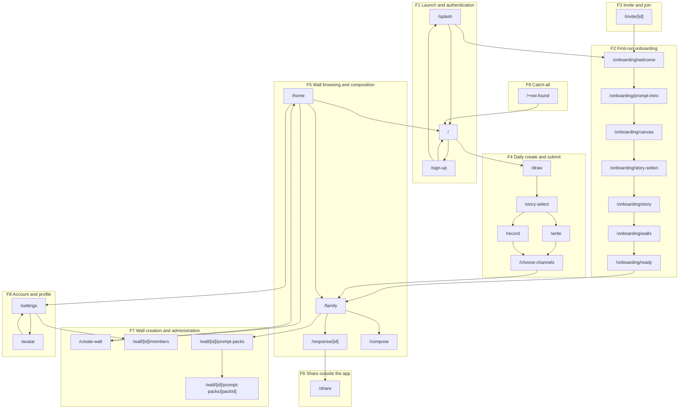

<!-- Generated by docs-sync from `product/design/screen-flow-inventory.md`. Do not hand-edit; edit the
     source and re-run `npm run docs:sync`. -->

# Screen and flow inventory

Every screen the POC app has, each one placed under a named user flow. This is the
input to the client feature-planning session: you cannot lay features against a
backlog until you agree on what screens exist and what journey each one serves.

The screen list comes from the app's router, not from the screenshot directory and
not from the capture script's route list. The router is what the app has; the
other two are what the tooling happens to reach. Where they disagree, that gap is
recorded below as a finding.

## Provenance

- Source of truth for screens: the `app/` directory of hs2studio/scribl-app,
  which is an Expo Router file-based router. 29 `.tsx` files, of which 27 are
  screens (`app/_layout.tsx` is a layout, `app/+not-found.tsx` is the catch-all
  404).
- Captures regenerated 2026-08-31 from `origin/main` at `c68de8d` via
  `npm run capture:board`. 29 tiles. The screenshots that existed before were 24
  PNGs all dated 2026-07-20, five weeks stale and predating the current
  assembler; nothing in this document rests on them.
- Flow names and orderings are taken from code and tests, not invented:
  `src/lib/onboardingFlow.ts`, `e2e/invite-flow.spec.ts`, `e2e/ux-flow.spec.ts`,
  `e2e/every-screen.spec.ts`.

## The four numbers

| Count | Value |
|-------|-------|
| Screens in the router | 27 |
| Screens reached by the regenerated capture | 27 |
| Screens placed in at least one flow | 27 |
| Orphan screens | 0 |

Placed plus orphaned equals the router count. `app/+not-found.tsx` is tracked
separately as the catch-all, and is listed under flow F9; it is not counted in
the 27 because no user journey routes to it deliberately.

Reached is not the same as shown. 27 of 27 screens have a tile, but only 20 tiles
show that screen's own interface. Seven are byte-identical copies of another
screen because a draft guard redirected the capture. See
[Finding 1](#finding-1-seven-tiles-are-redirect-artifacts-not-screens).

## Flow inventory

Nine flows. A screen may appear in more than one, and several do -- `/home` is a
hub, `/family` is where four different journeys land.

### F1 Launch and authentication

Get a person from a cold start to either onboarding or today's prompt.

`/splash` -> `/` -> `/sign-up` -> `/` or `/splash`

Splash never routes to sign-up directly. `app/splash.tsx:38-49` dwells 900ms then
goes to `/` if the person is onboarded, or to the resumed onboarding step if not.
`/` is what bounces a signed-out person: `app/index.tsx:44-46` replaces to
`/sign-up` when there is no current user. `/sign-up` carries sign-up, log-in and
an existing-user picker, and returns to `/` or back through `/splash` depending
on whether onboarding is done (`src/lib/postAuthRoute.ts:20-21`).

### F2 First-run onboarding

Walk a brand-new person through making their first Scribl before they see the
app proper.

`/onboarding/welcome` -> `/onboarding/prompt-intro` -> `/onboarding/canvas` ->
`/onboarding/story-select` -> `/onboarding/story` -> `/onboarding/walls` ->
`/onboarding/ready`

This exact seven-step order is `ONBOARDING_STEPS` in `src/lib/onboardingFlow.ts`.
Steps 4 through 6 are draft-required: with no drawing in hand, resume clamps back
to `/onboarding/canvas`.

### F3 Invite and join

An invited person arrives from outside the app, accepts, and lands in the wall
that invited them.

`/invite/[id]` -> F2 in full -> `/family` -> `/home`

Walked end to end by `e2e/invite-flow.spec.ts`, up to `/family`. The final step
to `/home` is a direct browser navigation in the spec
(`e2e/invite-flow.spec.ts:195`), not a click on an in-app control, so treat that
one edge as asserted rather than demonstrated. The invite screen is an in-app
stand-in for a hosted landing page, which is a feature-planning question in its
own right.

### F4 Daily create and submit

The daily loop: see today's prompt, draw it, caption it, choose who sees it.

`/` -> `/draw` -> `/story-select` -> (`/write` or `/record`) -> `/choose-channels`
-> `/family`

`e2e/ux-flow.spec.ts` walks this and the return trip. `/story-select` is the
either/or fork between typing and recording. `/write`, `/record`,
`/choose-channels` and `/story-select` are all draft-guarded: reached without a
drawing in the draft store they bounce to `/draw`.

### F5 Wall browsing, reactions and composition

Look at what people posted, react to it, and combine drawings into one piece.

`/home` -> `/family` -> `/response/[id]`, with `/family` -> `/compose` as a
branch.

`/compose` is the only screen with no persistent nav entry. It is reachable only
from a wall's multi-select and needs at least two source drawings
(`MIN_SOURCES = 2`).

### F6 Share outside the app

Take one response out of Scribl and into a message, a story or a camera roll.

`/response/[id]` -> `/share`

### F7 Wall creation and administration

Start a wall, get people into it, and decide what it asks.

`/home` -> `/create-wall` -> `/home`; `/settings` -> `/wall/[id]/members`;
`/family` -> `/wall/[id]/prompt-packs` -> `/wall/[id]/prompt-packs/[packId]`

The members screen is reached from Settings, not from the wall. The add-member
entry was deliberately removed from `app/family.tsx:1107-1111` and the only
remaining call site is `app/settings.tsx:164`, so this flow's one entry point
sits inside F8's screen. Worth raising at the planning session: wall
administration currently has no door on the wall itself.

Creator-only is true of one of the two, not both. Prompt packs are gated at the
entry point (`app/family.tsx:1092`). The members screen opens for any member of
the wall; only invite-by-email and remove-member are creator-gated inside it
(`app/wall/[id]/members.tsx:57`, `195-200`, `307`).

The two prompt-pack screens are a two-step picker: catalog, then the prompts
inside one pack.

### F8 Account and profile

Change your name, your email, your avatar, your theme.

`/home` -> `/settings` -> `/avatar` -> `/settings`

`/avatar` reuses the drawing canvas: you draw your own avatar rather than pick
one. `/settings` also links out to wall members, which is F7.

### F9 Catch-all

`/+not-found`

An on-brand 404 that offers a route back to today's prompt. No journey aims at
it; it exists so a bad link is not a dead end.

## Screen inventory

27 screens, every one with at least one flow. Route templates are Expo Router
templates; `[id]` and `[packId]` are dynamic segments. In the last column, the
value `not captured` is reserved for a screen the capture cannot reach at all;
every other value means the route was reached, and says what the tile actually
shows.

| Route | Router file | Flows | Capture shows the screen |
|-------|-------------|-------|--------------------------|
| `/` | `app/index.tsx` | F1, F4 | yes |
| `/splash` | `app/splash.tsx` | F1 | yes |
| `/sign-up` | `app/sign-up.tsx` | F1 | yes |
| `/home` | `app/home.tsx` | F3, F5, F7, F8 | yes |
| `/draw` | `app/draw.tsx` | F4 | yes |
| `/story-select` | `app/story-select.tsx` | F4 | no, shows `/draw` |
| `/write` | `app/write.tsx` | F4 | no, shows `/draw` |
| `/record` | `app/record.tsx` | F4 | no, shows `/draw` |
| `/choose-channels` | `app/choose-channels.tsx` | F4 | no, shows `/draw` |
| `/family` | `app/family.tsx` | F3, F4, F5, F7 | empty state only |
| `/compose` | `app/compose.tsx` | F5 | yes, guard message |
| `/response/[id]` | `app/response/[id].tsx` | F5, F6 | yes, artwork panel black |
| `/share` | `app/share.tsx` | F6 | yes |
| `/create-wall` | `app/create-wall.tsx` | F7 | yes |
| `/wall/[id]/members` | `app/wall/[id]/members.tsx` | F7 | yes |
| `/wall/[id]/prompt-packs` | `app/wall/[id]/prompt-packs/index.tsx` | F7 | yes |
| `/wall/[id]/prompt-packs/[packId]` | `app/wall/[id]/prompt-packs/[packId].tsx` | F7 | yes |
| `/settings` | `app/settings.tsx` | F8 | yes |
| `/avatar` | `app/avatar.tsx` | F8 | yes |
| `/invite/[id]` | `app/invite/[id].tsx` | F3 | yes |
| `/onboarding/welcome` | `app/onboarding/welcome.tsx` | F2, F3 | yes |
| `/onboarding/prompt-intro` | `app/onboarding/prompt-intro.tsx` | F2, F3 | yes |
| `/onboarding/canvas` | `app/onboarding/canvas.tsx` | F2, F3 | yes |
| `/onboarding/story-select` | `app/onboarding/story-select.tsx` | F2, F3 | no, shows `/onboarding/canvas` |
| `/onboarding/story` | `app/onboarding/story.tsx` | F2, F3 | no, shows `/onboarding/canvas` |
| `/onboarding/walls` | `app/onboarding/walls.tsx` | F2, F3 | no, shows `/onboarding/canvas` |
| `/onboarding/ready` | `app/onboarding/ready.tsx` | F2, F3 | yes |
| `/+not-found` | `app/+not-found.tsx` | F9 | yes |

## Orphan screens

None. All 27 router screens are placed in at least one flow, and every placement
above cites either a route in an e2e spec, a router call in the screen's own
source, or the onboarding step list.

This section is a required deliverable and is checked mechanically, not by eye.
`npm run test:flow-inventory` parses the screen table and the flow sections in
this file and fails if any screen carries no flow, if a flow section references a
route that is not in the table, or if the four counts do not reconcile. The check
was proved to fail: deleting the `Flows` entry for `/compose` made it report one
orphan and a count mismatch, and restoring the entry made it pass again.

## Findings

### Finding 1: seven tiles are redirect artifacts, not screens

Seven of the 29 tiles are byte-identical copies of another tile. Confirmed by
checksum, not by eye:

- `/write`, `/record`, `/story-select` and `/choose-channels` all produce the
  same image as `/draw`.
- `/onboarding/story-select`, `/onboarding/story` and `/onboarding/walls` all
  produce the same image as `/onboarding/canvas`.

This is the draft guard doing its job. Those seven screens refuse to render
without a drawing in the draft store, and the capture visits each route cold, so
each one bounces. `routes.mjs` already knows about two of them and tags them
`note: "draft-guard redirect to /draw"`, but the note is metadata; the tile it
produces still looks like a real screen on the board.

Why it matters for the planning session: four of those seven are the caption,
voice-note and audience-choice steps, which is where a lot of the feature
conversation will land. Nobody can point at a picture of them today. The capture
needs to seed a draft before visiting them, the same way `e2e/ux-flow.spec.ts`
already does.

### Finding 2: `/family` captures an empty state

The `/family` tile reads "Pick a family wall from Home." The route is reached but
no wall is in context, so the wall grid never renders. `/family` is the landing
point for four of the nine flows, which makes it the single most consequential
screen with no representative capture.

### Finding 3: the `/response/[id]` artwork panel renders solid black

The response viewer captures correctly -- prompt, author, timestamp, reaction
control -- but the artwork itself is a solid black rectangle. Either the Skia
canvas is not painting on web in the capture environment, or the seeded response
carries no strokes. Worth a look before the board is shown to anyone: it reads as
a broken screen.

### Finding 4: the logged-out `/sign-up` tile adds nothing

`capture-board.spec.ts` takes an extra capture of `/sign-up` while logged out.
That tile is byte-identical to the logged-in one. The intent was presumably to
show a different state; it does not.

### Finding 5: `ux-flow-spec.md` in the app repo is stale

`docs/design/ux-flow-spec.md` documents `/tutorial`, a bare `/wall`,
`/create-challenge` and `/challenge/[id]`, none of which exist in the router
today. It does not mention the seven `/onboarding/*` screens, `/invite/[id]`,
`/avatar`, `/compose`, `/story-select`, or either prompt-pack screen. It
describes an earlier app. This inventory supersedes it as the screen list; its
back-stack rules R1 to R6 are still accurate and still useful.

### Finding 6: `screenshot-all.mjs` is stale but harmless

The older capture script still lists `/tutorial` and a bare `/wall`, neither of
which the router has. It is dev-only and not wired into CI. It covers no route
that `capture:board` misses.

## Route coverage: no hole in the tooling

Worth stating plainly, because it was the expected finding and it is not what we
found. `routes.mjs` does not carry a hand-maintained route list. It parses the
"Static routes (N):" block out of a real `npx expo export -p web` and throws if
the declared count and the parsed count disagree. Static routes ride a generic
fallback, so a newly added static screen is captured with no code change. A newly
added dynamic route throws `unmapped route template` rather than being skipped
silently.

So every one of the 27 router screens is reached. The tooling's weakness is not
route coverage, it is state coverage: it can reach a route but cannot always put
the app in a state where that route renders itself. Findings 1 and 2 are the
whole of that gap.

### Recommendation, not done here

`resolveCaptureUrls` should seed a draft before visiting the seven draft-guarded
routes, and should visit `/family` with a wall in context. That is a change to the
capture tooling in the app repo and is deliberately out of scope for this pass.

## Flow diagram

Nine flows, every screen inside one. Read it as journeys, not as a complete edge
list of every possible navigation.

## Out of scope for this pass

- Per-screen feature extraction and any mapping onto the existing backlog.
- Any edit to `docs/backlog-epics.md`, `docs/production-backlog.md`,
  `docs/epics/` or `docs/stories/`. The team has one real backlog; a second one
  grown here would be worse than none.
- Any change to the capture tooling in the app repo.
