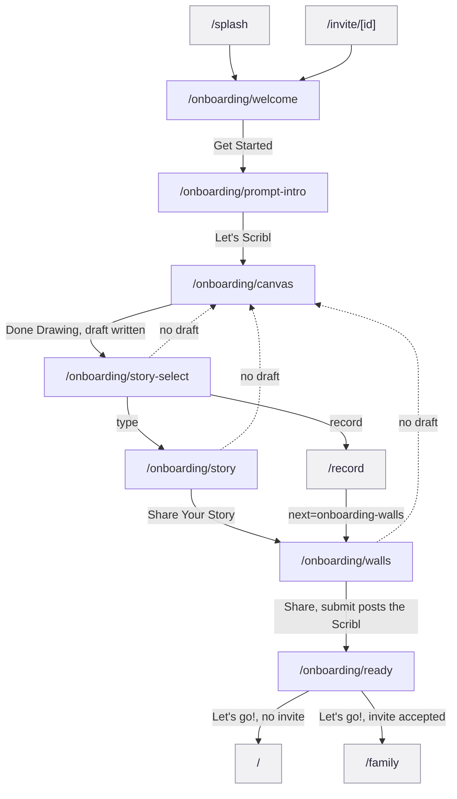

<!-- Generated by docs-sync from `product/prototype/workflows/f2-first-run-onboarding.md`. Do not hand-edit; edit the
     source and re-run `npm run docs:sync`. -->

# F2 First-run onboarding

Walk a brand-new person through making their first Scribl before they see the
app proper. Seven screens, one drawing, and a hard rule that you cannot skip the
drawing.

This is the flow that decides whether someone ever posts anything. Everything
after it assumes a draft exists.

## Provenance

- **Features, routes, guards and data calls** cited to hs2studio/scribl-app at
  `c1b3c2d` on `main`, clean tree.
- **Tiles** from `npm run capture:board` at scribl-app `72c3ab8`, captured
  2026-08-31, committed here under `docs/public/assets/prototype/`. `72c3ab8` is
  not on `main`: it is an unmerged flow-map branch that seeds a draft before
  visiting the draft-guarded routes. That matters, and is the subject of
  [the capture note](#these-tiles-are-newer-than-the-inventory-and-nothing-said-so).
- **Flow name, number and membership** from the
  [screen and flow inventory](/design/screen-flow-inventory).

## The journey

Solid arrows are the forward journey. Dashed arrows are the draft guard clamping
a person back. Grey nodes sit outside F2.

The seven-step order is not a documentation convention, it is
`ONBOARDING_STEPS` in `src/lib/onboardingFlow.ts:11-19`, and it is the same list
the resume logic and the e2e spec read.

## Screens in this flow

| Route | What it is for | Screen page |
|-------|----------------|-------------|
| `/onboarding/welcome` | Say what Scribl is and set the expectation that this is a guided first run | [`/onboarding/welcome`](/prototype/screens/onboarding-welcome) |
| `/onboarding/prompt-intro` | Show today's prompt before asking for a drawing, so the ask has a subject | [`/onboarding/prompt-intro`](/prototype/screens/onboarding-prompt-intro) |
| `/onboarding/canvas` | Draw the answer. The one screen in the flow that produces state | [`/onboarding/canvas`](/prototype/screens/onboarding-canvas) |
| `/onboarding/story-select` | Fork: type the story or record it. The two branches do not rejoin | [`/onboarding/story-select`](/prototype/screens/onboarding-story-select) |
| `/onboarding/story` | Write the caption, 280 characters. Typed path only | [`/onboarding/story`](/prototype/screens/onboarding-story) |
| `/onboarding/walls` | Choose the walls, and post. The submit call fires here | [`/onboarding/walls`](/prototype/screens/onboarding-walls) |
| `/onboarding/ready` | Confirm it posted and hand over to the app | [`/onboarding/ready`](/prototype/screens/onboarding-ready) |

Every one of these is also in F3 Invite and join, which enters F2 in full rather
than short-circuiting it.

One screen the recorded path uses is not in this table and not in F2:
`/record`, which the inventory places in F4. See
[the recorded-path note](#the-recorded-path-leaves-the-onboarding-step-list).

## Guards and forks

**The draft guard.** Three of the seven steps refuse to render without a drawing
in hand: `story-select`, `story` and `walls`, listed as
`DRAFT_REQUIRED_STEPS` in `src/lib/onboardingFlow.ts:34`. Reached without one,
`resumeStep()` returns `canvas` instead
(`src/lib/onboardingFlow.ts:53-60`). `/onboarding/ready` is deliberately
excluded from the guard, with the reason written into the source
(`src/lib/onboardingFlow.ts:26-33`) -- by then the post has happened and the
draft is spent.

"In hand" means one specific thing: `useDraftStore`'s `imageRef` is not null.
`/splash` reads exactly that and passes it into the resume decision
(`app/splash.tsx:53-54`).

**Resume is per-user and persisted.** Each onboarding screen writes its own step
name on mount through `useOnboardingStep()`
(`src/lib/useOnboardingStep.ts:13-19`), which lands in AsyncStorage under a
per-user key (`src/stores/useOnboardingStore.ts:220`). Close the app on step 5
and you come back to step 5, unless the draft is gone, in which case you come
back to step 3.

**The type-or-record fork, and it is a real fork.** `/onboarding/story-select`
offers a text box and a microphone, captioned "280 characters or less" and "30
seconds or less". The two branches do not converge. Typing goes to
`/onboarding/story` (`app/onboarding/story-select.tsx:45`). Recording goes to
`/record`, an F4 screen, carrying `params: { next: "onboarding-walls" }`
(`app/onboarding/story-select.tsx:60`), and never touches `/onboarding/story` at
all. So only the typed path visits step 5 of 7. See
[the recorded-path note](#the-recorded-path-leaves-the-onboarding-step-list).

**The two exits.** `/onboarding/ready` branches on whether an accepted invite is
waiting. With one, it lands in that wall,
`router.replace` to `/family` with the wall id
(`app/onboarding/ready.tsx:73`). Without, it lands on today's prompt at `/`
(`app/onboarding/ready.tsx:76`). This is the seam between F2 and F3.

**Walked end to end by a spec.** `e2e/onboarding.spec.ts:29` steps all seven
screens and asserts the landing. It also covers resume-at-saved-step (`:146`)
and not re-running onboarding for someone already onboarded (`:126`). So this
flow is demonstrated, not just asserted.

## What the capture shows

All seven steps, in journey order. Every one renders its own interface. Click a
tile to open it larger.

<figure><figcaption><strong>1 /onboarding/welcome</strong>What Scribl is, and a Get Started button.</figcaption></figure>
<figure><figcaption><strong>2 /onboarding/prompt-intro</strong>Today's prompt, before the ask to draw it.</figcaption></figure>
<figure><figcaption><strong>3 /onboarding/canvas</strong>The drawing, with a seeded creature on the canvas.</figcaption></figure>
<figure><figcaption><strong>4 /onboarding/story-select</strong>Type it or record it.</figcaption></figure>
<figure><figcaption><strong>5 /onboarding/story</strong>The 280-character caption. Thumbnail is wrong, see note 2.</figcaption></figure>
<figure><figcaption><strong>6 /onboarding/walls</strong>Pick the walls. Button disabled until one is picked.</figcaption></figure>
<figure><figcaption><strong>7 /onboarding/ready</strong>Confirmation, and the handover to the app.</figcaption></figure>

Three things the tiles show that the prose above does not:

- **The prompt string is consistent.** `/onboarding/prompt-intro` and
  `/onboarding/canvas` both show "Draw what your name would look like as a
  creature". Both read `usePromptStore`, so they cannot disagree.
- **The story screen's thumbnail is not the drawing.** Step 5 shows a generic
  sun glyph where the creature from step 3 should be. See
  [the thumbnail note](#the-story-screen-thumbnail-is-not-your-drawing).
- **The walls button is disabled, not missing.** Step 6's primary button is grey
  and unlabelled because no wall is selected. The copy says "you can pick as
  many walls as you like", so this is a multi-select gated on at least one
  choice.

## Notes for planning

Authored here, not read out of the app.

### These tiles are newer than the inventory, and nothing said so

The [inventory's Finding 1](/design/screen-flow-inventory) says
`/onboarding/story-select`, `/onboarding/story` and `/onboarding/walls` capture
as copies of `/onboarding/canvas`. True of the capture it read, at `c68de8d` on
`main`. Not true of the tiles above: all seven have distinct checksums and each
renders its own screen, because `72c3ab8` seeds a draft first.

This is not confined to F2. Writing the other eight flow pages against the same
capture found the inventory's capture column stale in three more places:
`/family` shows a populated wall rather than the "Pick a family wall from Home"
empty state of Finding 2, `/compose` shows the real composer rather than a guard
message, and `/response/[id]` shows a drawing rather than the solid black
rectangle of Finding 3.

So the whole "Capture shows the screen" column, and Findings 1 through 3,
describe a capture that no longer exists. Three things follow, all needing a
decision rather than a note:

- **The inventory is stale, and nothing said so.** Its own gate,
  `npm run test:flow-inventory`, checks that every screen has a flow and that
  the counts reconcile. It cannot check whether a claim about a screenshot is
  still true. Not corrected here, because correcting it is its own unit of work
  against a gated document, but it should not wait long.
- **The gate has a blind spot worth closing.** A capture column that goes stale
  silently every time a new capture lands is a recurring cost, not a one-off.
  Either the column moves to where the captures live, or the gate learns to
  compare tile checksums against what the document claims.
- **`72c3ab8` is unmerged.** If it does not land, the next capture run regresses
  to tiles that cannot show four of the seven steps here, plus the three screens
  above.

### The story screen thumbnail is not your drawing

`/onboarding/story` shows a sun glyph where the person's own drawing should be,
two screens after they drew a creature.

The screen is not at fault. It reads `imageRef` off the draft store
(`app/onboarding/story.tsx:25`) and renders it through `DrawingImage`
(`:59-67`), and its fallback for a missing image is a crayon doodle, not a sun
(`:62-66`). A crayon would mean "no drawing". A sun means the capture's seeded
draft really does hold a sun.

Which is confirmed by looking wider: the same orange sun appears on
`/response/[id]` and `/share` too. That is one seed-data defect showing up on
three screens, not three separate bugs, and it is a property of the capture
harness rather than of the app. Worth fixing before this board goes in front of
anyone, because "here is your drawing" showing stock clip art is the kind of
thing that gets noticed immediately. It does not affect the feature and API
facts on any of the three screen pages.

### The drawing is the whole gate

Three of seven steps are hard-gated on a drawing existing, and the drawing lives
only in a local store keyed by nothing durable. There is no server-side draft.
Anything that clears app storage mid-onboarding sends a person back to step 3
with their drawing gone. Whether that is acceptable is a product call, and it is
not recorded anywhere as having been made.

### No way back

`/onboarding/canvas` has no back or skip affordance. Neither, as far as the
capture shows, do the other six. Forward-only is a defensible choice for a
seven-step first run, but it is currently a choice by omission rather than a
stated one.

### The recorded path leaves the onboarding step list

`ONBOARDING_STEPS` (`src/lib/onboardingFlow.ts:11-19`) has seven entries and
`/record` is not one of them. But the record branch of step 4 routes straight
there (`app/onboarding/story-select.tsx:60`), handing it
`next: "onboarding-walls"` so it knows how to get back.

That has three consequences nobody appears to have decided on:

- **Resume cannot represent it.** The persisted step is one of the seven names.
  A person who closes the app while recording resumes at `story-select`, not at
  `/record`, and re-picks the fork.
- **The inventory places `/record` in F4 only.** It is genuinely in both, and
  the screen inventory does not say so. This is a real gap in that document,
  found here rather than there.
- **Half the flow is untested by the onboarding spec.**
  `e2e/onboarding.spec.ts:29` walks the typed path. Nothing walks the recorded
  one end to end, so the branch that leaves the step list is also the branch
  with no coverage.
