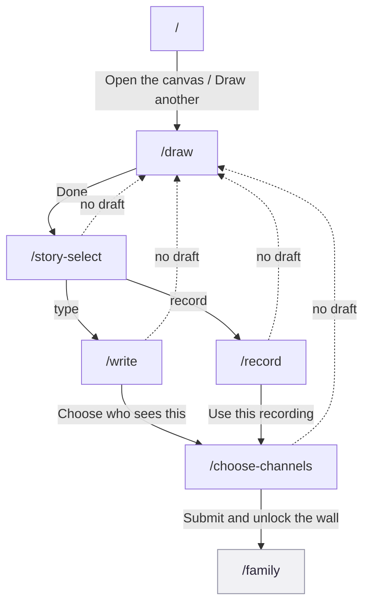

<!-- Generated by docs-sync from `product/prototype/workflows/f4-daily-create-and-submit.md`. Do not hand-edit; edit the
     source and re-run `npm run docs:sync`. -->

# F4 Daily create and submit

The daily loop: see today's prompt, draw it, caption it, choose who sees it.
Five screens, one drawing, and a submit call that unlocks a wall for everyone
in it. This is the flow the product's whole daily habit depends on; every
other flow either feeds into it or reads what it produced.

## Provenance

- **Features, routes, guards and data calls** cited to hs2studio/scribl-app at
  `c1b3c2d` on `main`, clean tree.
- **Tiles** from `npm run capture:board` at scribl-app `72c3ab8`, captured
  2026-08-31, committed here under `docs/public/assets/prototype/`. `72c3ab8`
  is not on `main`: it is the unmerged flow-map branch that seeds a draft
  before visiting the draft-guarded routes, and it also seeds an account
  whose day is already submitted for the `/` tile. Both facts matter below.
- **Flow name, number and membership** from the
  [screen and flow inventory](/design/screen-flow-inventory).

## The journey

Solid arrows are the forward journey, labelled with the real control. Dashed
arrows are the draft guard clamping a person back to `/draw`. The grey node
sits outside this flow's own screen surface.

## Screens in this flow

| Route | What it is for | Screen page |
|-------|-----------------|-------------|
| `/` | Show today's prompt and open the canvas | [`/`](/prototype/screens/root-today) |
| `/draw` | Draw the answer, export it into a draft | [`/draw`](/prototype/screens/draw) |
| `/story-select` | Fork: type the story or record it | [`/story-select`](/prototype/screens/story-select) |
| `/write` | Caption the drawing, 280 characters, typed path | [`/write`](/prototype/screens/write) |
| `/record` | Record the story, 30 seconds, voice path | [`/record`](/prototype/screens/record) |
| `/choose-channels` | Pick who sees it, and submit | [`/choose-channels`](/prototype/screens/choose-channels) |

`/family` is where a successful submit lands; see
[F5 Wall browsing and composition](/prototype/screens/family) for what that
screen does once you are there.

## Guards and forks

**The draft guard is the defining property of this flow.**
`/story-select`, `/write`, `/record`, and `/choose-channels` all read
`useDraftStore`'s `imageRef` on mount and bounce to `/draw` if it is empty
(`app/story-select.tsx:30-33`, `app/write.tsx:50-53`,
`app/record.tsx:75-80`, `app/choose-channels.tsx:49-52`). Reached cold, a
bookmark, a shared link, a stale web tab, every one of these four routes is
unreachable; the person lands back at the canvas with no explanation of why.
In practice this means the four post-draw screens have exactly one entry
point: falling through from `/draw`. `/choose-channels` reads the guard
through `getState()` specifically so clearing the draft on a successful
submit does not re-trigger the bounce and eject the person from the wall
they just unlocked (`app/choose-channels.tsx:46-52`).

**The type-or-record fork does not rejoin.** `/story-select` sends a person
to `/write` or to `/record`; both are one-way in the sense that a caption
and a recording cannot coexist. `setCaption` and `setAudio` each clear the
other field (`src/stores/useDraftStore.ts:72-74`), and the server enforces
the same exclusivity with a CHECK constraint rejected at
`backend/lambda/handlers/submit.ts:64-70`. Switching from one path to the
other mid-flow silently discards whatever was already drafted on the
abandoned path.

**Submit fires exactly once, from one screen, with no visible double-tap
guard.** `dataClient.submit()` -> `POST /submit` fires only from
`/choose-channels` (`app/choose-channels.tsx:76-88`, handler
`backend/lambda/handlers/submit.ts`). The submission id is deterministic,
`submission-${userId}-${promptId}` (`backend/lambda/handlers/submit.ts:84`),
which reads as an intentional idempotency key: the same user submitting the
same prompt twice should not create two rows. But nothing on the client
protects against a double submit beyond a `submitting` boolean disabling the
button mid-flight (`app/choose-channels.tsx:170`). A second tap landing
between render and disable, or a retried request after a slow response the
person assumes failed, is not visibly guarded against from this file alone.
Whether the id collision behaves as a clean upsert or a duplicate-key error
is a data-layer question this pass did not open.

**Voice notes only work on the browser the capture tool could not
simulate.** `/record`'s capture tile shows the "Voice notes aren't available
here yet" fallback, not the real microphone UI, because the capture
browser fails `isRecordingSupported()`
(`src/services/audioRecorder.ts:55-59`, checked at `app/record.tsx:62`).
That check requires `navigator.mediaDevices.getUserMedia` and a global
`MediaRecorder`, both web-only APIs, so a native build shows the identical
unsupported message on every platform, always, not just in this capture
(`src/services/audioRecorder.ts:55-59`). `/story-select` offers the
microphone card unconditionally regardless of platform
(`app/story-select.tsx:65-78`), so there is no upfront signal on that screen
that the mic card is about to fail; the only way to find out is to tap it
and reach `/record`.

**A stale comment understates how real voice capture is.**
`src/lib/storyLimits.ts`'s doc comment says "voice capture itself stays
stubbed for the POC" (`src/lib/storyLimits.ts:7-8`). That is not true of
what shipped: `src/services/audioRecorder.ts` wraps a real `MediaRecorder`,
`src/services/audioUpload.ts` performs a real upload to `POST /audio`
(`backend/lambda/handlers/audio-upload.ts`), and the server measures and
clamps duration itself rather than trusting the client
(`backend/lambda/handlers/audio-upload.ts:13-18`). This is the opposite
planning hazard from the usual one: instead of a comment overselling an
unfinished feature, this one undersells a finished one, and anyone reading
the comment instead of the code would materially misjudge how much of
voice capture is built.

## What the capture shows

<figure><figcaption><strong>1 /</strong>Already-submitted state: button reads Draw another, not Open the canvas.</figcaption></figure>
<figure><figcaption><strong>2 /draw</strong>The seeded draft, drawn on the reduced palette.</figcaption></figure>
<figure><figcaption><strong>3 /story-select</strong>The fork, no third option.</figcaption></figure>
<figure><figcaption><strong>4 /write</strong>The typed path, real image, 0 of 280.</figcaption></figure>
<figure><figcaption><strong>5 /record</strong>The unsupported-browser fallback, not the real mic UI.</figcaption></figure>
<figure><figcaption><strong>6 /choose-channels</strong>The fan-out picker, both rows unselected.</figcaption></figure>
<figure><figcaption><strong>7 /family</strong>Where submit lands.</figcaption></figure>

Three things these tiles settle, including where they go blind:

- **The record tile is the flow's one capture blind spot.** Because the tool
  cannot simulate a working microphone, the single most consequential fact
  about `/record`, whether recording is real, is invisible in the artifact
  meant to document it. It had to be established from the source instead.
- **The write tile's image is the actual drawing, not a placeholder.** The
  sun on `/write`'s preview card is the seeded draft's real `imageRef`,
  rendered through `DrawingImage`, not the crayon-doodle fallback that only
  shows when the image is missing.
- **The prompt-of-day tile captures the "already done today" state, not the
  first-touch state.** The button reads "Draw another" and the body says the
  day's Scribl was already sent, a real and reachable state, but a different
  one than a person's first visit to `/` on a given day.

## Notes for planning

Authored here, not read out of the app.

### The guard is stricter than a UX nicety, it is the reason drafts can be huge

The draft never travels as a route param; the drawing's data URI is too
large and unreliable for that, per `useDraftStore`'s own comment
(`src/stores/useDraftStore.ts:23-25`). That constraint is what makes the
draft-guard-on-four-screens pattern necessary in the first place: there is
no other way to carry a drawing through this flow than a shared in-memory
store, and any screen reached without that store populated has structurally
nothing to render.

### Submit's idempotency key deserves a real test, not an inference

The deterministic submission id looks deliberate, and the surrounding code
reads as careful (a `submitting` boolean, an explicit error path that keeps
the picker state on failure). But "looks deliberate" is not the same as
"verified to behave correctly under a double-tap or a retry," and nothing in
this pass opened the data layer to check. This is worth a real test before
anyone treats submit as safe against duplicate rows.

### Voice's finished state and its comment's claimed state point in opposite directions

Most stale-comment findings in this kind of review go one way: a comment
promises more than the code delivers. This one is the rarer case, a comment
that promises less. Both are planning hazards, but the fix for this one is
cheap: correct or delete the line in `src/lib/storyLimits.ts` so voice
capture's actual maturity is visible to the next person who reads that file
instead of the running code.
