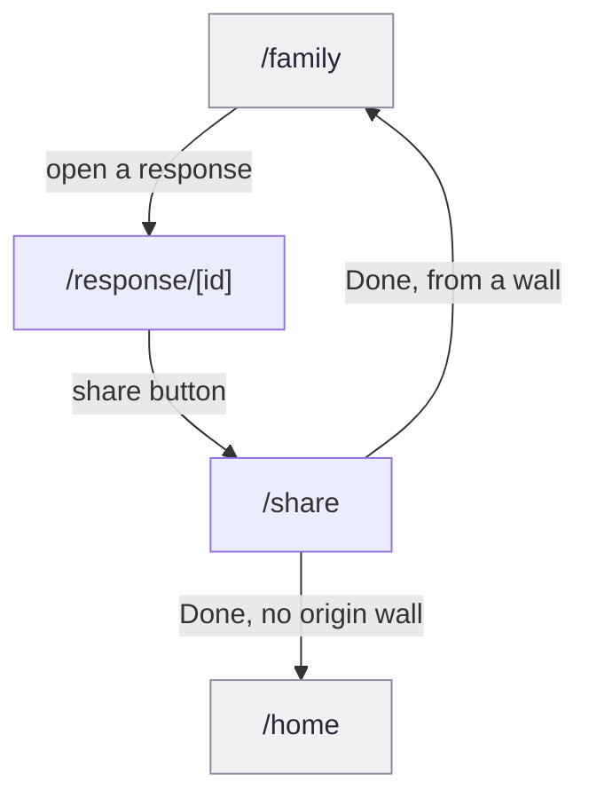

<!-- Generated by docs-sync from `product/prototype/workflows/f6-share-outside-the-app.md`. Do not hand-edit; edit the
     source and re-run `npm run docs:sync`. -->

# F6 Share outside the app

Take one response out of Scribl and into a message, a story, or a camera
roll. Two screens: the detail view a share starts from, and the share sheet
itself.

This is the flow that decides whether a Scribl leaves the app at all, and
whether the place it lands still says Scribl when it gets there.

## Provenance

- **Features, routes, guards and data calls** cited to hs2studio/scribl-app at
  `c1b3c2d` on `main`, clean tree.
- **Tiles** from `npm run capture:board` at scribl-app `72c3ab8`, captured
  2026-08-31, committed here under `docs/public/assets/prototype/`. `72c3ab8`
  is not on `main`: it is an unmerged flow-map branch that seeds a draft and a
  response before visiting the routes below cold.
- **Flow name, number and membership** from the
  [screen and flow inventory](/design/screen-flow-inventory).

## The journey

Solid arrows are the forward journey, labelled with the real control. There
are no guards or bounces inside F6 itself; every fork in this diagram is an
exit, not a refusal. Grey nodes sit outside F6: `/family` belongs to F5 and
`/home` is F5/F3/F7/F8's shared hub.

## Screens in this flow

| Route | What it is for | Screen page |
|-------|-----------------|-------------|
| `/response/[id]` | The detail view a share starts from; F6's only entry point | [`/response/[id]`](/prototype/screens/response-id) |
| `/share` | Build a branded share card and hand it to a target: the OS share sheet, a copied link, or a stub | [`/share`](/prototype/screens/share) |

`/response/[id]` also belongs to F5; its browsing and reaction features are
covered there. Here it matters only for one control: the header share button,
which pushes the full response payload as route params to `/share`
(`app/response/[id].tsx:230-268`, `:239-267`), not through a store.

## Guards and forks

There is no gate inside F6 that blocks forward progress; the only real fork is
which target tile a person taps on `/share`, and that is where the flow's real
finding sits.

**Two of the four share targets are stubs, not features.** "Instagram" is a
bare `onPress` with only a code comment, `/* stub: Instagram share target not
wired for POC */` (`app/share.tsx:503-510`). "More" is the same shape,
`/* stub: additional share targets not wired for POC */`
(`app/share.tsx:512-520`). Both render identically to the two tiles that
work: no disabled state, no badge, no different weight. A person taps either
and nothing happens, with no toast and no visible log. This is the finding to
lead with. It is a defensible corner to cut in a POC, but it is not something
to demo without a caveat.

**The other two targets are real, and one of them is genuinely engineered.**
"Share" dispatches the OS share sheet with a captured card image, built on
`html2canvas` on web (with a manual scale fix and a real-height stabilizer,
`app/share.tsx:104-130`) or `react-native-view-shot` on native, and falls back
to a URL share on any capture or API failure (`app/share.tsx:406-456`). It
carries a documented module-level dedup guard for a specific double-dispatch
bug seen on web (`app/share.tsx:54-78`). "Copy link" copies the response URL
on web, or falls back to `handleShare` where there is no clipboard API
(`app/share.tsx:485-492`). Neither is a stub; the stub finding above applies
to exactly half the sheet, not the whole screen.

**Exit branches on where the share started, not on which target was used.**
"Done" replaces to `/family` with `originChannelId` if one was set, else to
`/home` (`app/share.tsx:657-666`). No API call records that a share happened;
the only server round trip on this screen is `listChannelDays` used to
resolve the caption's prompt text, which is a lookup, not part of the share
action itself (`app/share.tsx:273-289`).

## What the capture shows

Journey order: the response detail leaf and the share sheet it opens.

<figure><figcaption><strong>1 /response/[id]</strong>F6's entry point, via the header share button.</figcaption></figure>
<figure><figcaption><strong>2 /share</strong>The share card and its four target tiles, two of them stubbed.</figcaption></figure>

What the tiles show that the prose above does not:

- **Both tiles carry the same seed-data placeholder.** Both show an orange
  sun-and-rays glyph in place of the real drawing, the same placeholder that
  also appears on `/onboarding/story`. It is one seed-data defect surfacing on
  three screens, not three bugs, and it does not affect the feature or API
  facts on either screen page.
- **All four target tiles look identical in weight.** "Share," "Instagram,"
  "Copy link," and "More" render as the same size, same style, same enabled
  look. Nothing in the tile itself hints that two of the four are inert; that
  has to be read from the source, not seen on screen.

## Notes for planning

Authored here, not read out of the app.

### The stub finding is the headline for this flow, not a footnote

F6 is a two-screen flow, and half of the second screen's primary controls do
nothing. A client walkthrough that lands on `/share` and taps "Instagram"
will hit silence with no explanation. The fix is cheap, either grey the stub
tiles out or add a "coming soon" toast, and it should happen before this
screen is shown to anyone outside the build team.

### The real half of the share sheet deserves equal billing

It would be easy to read the stub finding as "the share screen is fake." It
is not: the working half captures a real branded PNG on both web and native,
with a documented fix for a specific double-dispatch bug already found and
handled. Saying only "two stubs" without also saying "two engineered paths"
undersells the screen.

### No record that a share ever happened

Nothing on `/share` calls the API to log a share event; the whole action is a
local OS dispatch or a clipboard write (`app/share.tsx:406-456`). That may be
fine for a POC, but it means there is currently no way to answer "how many
people actually shared something" without adding that call.
