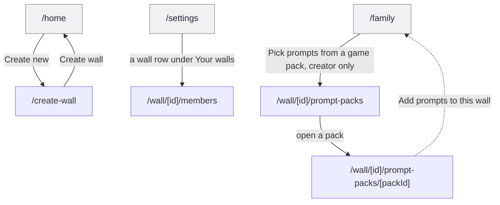

<!-- Generated by docs-sync from `product/prototype/workflows/f7-wall-creation-and-administration.md`. Do not hand-edit; edit the
     source and re-run `npm run docs:sync`. -->

# F7 Wall creation and administration

Start a wall, get people into it, and decide what it asks. Three separate
jobs, and, as built, three separate strands that never touch each other on
screen.

This is the flow a planning session is most likely to draw as one clean line.
It is not one line. It is three doors into two features that live inside
other flows' screens.

## Provenance

- **Features, routes, guards and data calls** cited to hs2studio/scribl-app at
  `c1b3c2d` on `main`, clean tree.
- **Tiles** from `npm run capture:board` at scribl-app `72c3ab8`, captured
  2026-08-31, committed here under `docs/public/assets/prototype/`. `72c3ab8`
  is not on `main`; it is an unmerged flow-map branch. None of this flow's
  four screens are draft-guarded, so the caveat matters less here than in F2,
  but the branch is still the source of every tile below.
- **Flow name, number and membership** from the
  [screen and flow inventory](/design/screen-flow-inventory).

## The journey

Solid arrows are the forward journey inside a strand, labelled with the real
button text. The dashed arrow off `/wall/[id]/prompt-packs/[packId]` marks a
`router.replace` bounce back out of F7 entirely, not a guard. Grey nodes
(`/home`, `/settings`, `/family`) sit outside F7, in F5 and F8; they are drawn
because they are the only doors into this flow's screens, not because they
belong to it.

## Screens in this flow

| Route | What it is for | Screen page |
|-------|-----------------|-------------|
| `/create-wall` | Name a new wall and, optionally, invite people to it | [`/create-wall`](/prototype/screens/create-wall) |
| `/wall/[id]/members` | View the roster; invite, remove, leave or delete | [`/wall/[id]/members`](/prototype/screens/wall-id-members) |
| `/wall/[id]/prompt-packs` | Write a custom prompt or browse the pack catalog | [`/wall/[id]/prompt-packs`](/prototype/screens/wall-id-prompt-packs) |
| `/wall/[id]/prompt-packs/[packId]` | Pick up to 5 prompts from one pack and add them | [`/wall/[id]/prompt-packs/[packId]`](/prototype/screens/wall-id-prompt-packs-packid) |

`/home`, `/settings` and `/family` are entry points this flow depends on but
does not own; they belong to F5 Wall browsing and composition and F8 Account
and profile.

## Guards and forks

**Wall administration has no door on the wall itself.** This is the headline
finding for F7, established on the members screen page. The add-member
affordance that once lived on `/family` was deliberately removed
(`app/family.tsx:1107-1111`), with a comment recording the reason: "Adding a
member is rare, and this button sat on a screen people use every day for a
once-in-a-while action. It's still reachable from Settings." The only
surviving call site is `app/settings.tsx:164`, an F8 screen. So the one thing
this flow is named for, administering a wall, has zero entry points from
anywhere that looks like the wall. A person managing a wall's membership has
to leave the wall to do it.

**Two admin features, two different gating strategies, and they disagree.**
Prompt packs and members sit one hop apart conceptually but are gated
opposite ways. Prompt packs gate at the entry point: `isWallCreator` guards
the button on `/family` before the screen ever renders
(`app/family.tsx:1092`), so a non-creator never reaches
`/wall/[id]/prompt-packs` at all. Members gates inside the screen instead: any
member of the wall can open `/wall/[id]/members`, and only the specific
write actions, invite (`app/wall/[id]/members.tsx:57-62`), remove-member
(`:306-307`), and delete (`:62`) check `isCreator` once the screen has already
rendered. Flattening these into one "creator-only admin" rule in a spec gives
the wrong answer for whichever one you didn't read closely.

**Create-wall writes for real, the invite step does not.** `/create-wall`
issues a genuine `POST /walls` with a real server id
(`app/create-wall.tsx:44-105`). The optional invite-by-email step that
follows looks identical from the UI but sends no email; it only writes a
local pending-invite record so the same device can later show "invited"
(`src/lib/simulatedInvites.ts`, `app/create-wall.tsx:70-84`). The same
simulated mechanism backs the invite box on `/wall/[id]/members`
(`app/wall/[id]/members.tsx:28-32`, `140-150`).

**The pack cap fails silently.** On `/wall/[id]/prompt-packs/[packId]`,
selecting a sixth prompt while five are already checked does nothing
(`app/wall/[id]/prompt-packs/[packId].tsx:39`). No toast, no shake, nothing
beyond the "0/5 selected" counter to notice. The catalog screen's own custom
prompt add, by contrast, is the flow's other real write and does surface a
per-address failure (`app/create-wall.tsx:89-98`, `162-166`), so silence here
is specific to the pack cap, not a flow-wide pattern.

**Custom prompt authoring is a router workaround, not a design choice.** The
"write your own prompt" card sits inline on `/wall/[id]/prompt-packs` rather
than on its own route because a sibling
`/wall/[id]/prompt-packs/custom` path would collide with the dynamic
`[packId]` segment and render as an unknown pack
(`app/wall/[id]/prompt-packs/index.tsx:31-35`). If custom-prompt authoring
grows past one text field, that workaround runs out of room.

## What the capture shows

Four screens across three strands. Click a tile to open it larger.

<figure><figcaption><strong>1 /create-wall</strong>Empty form, submit disabled until a name is entered.</figcaption></figure>
<figure><figcaption><strong>2 /wall/[id]/members</strong>Populated roster, viewed as the wall's creator.</figcaption></figure>
<figure><figcaption><strong>3 /wall/[id]/prompt-packs</strong>The custom-prompt card sits above the catalog, not below it.</figcaption></figure>
<figure><figcaption><strong>4 /wall/[id]/prompt-packs/[packId]</strong>Zero selected, so the button reads with no count.</figcaption></figure>

Two things the tiles settle, and both are about what they cannot show:

- **The members tile is a creator's view, not a generic one.** Rob's own row
  carries no Remove link while Alice's and Sam's do. A non-creator's view of
  this same screen, no invite card, no Remove links, no delete row, has no
  tile in this set; nothing here shows what the more common, less-privileged
  view looks like.
- **Create-wall's tile proves nothing about the invite step.** Both fields
  are blank and the button is greyed out, so the capture cannot show the
  parse-failure feedback the code supports, or a populated invite list. The
  screenshot proves the empty state renders, not that the invite flow works
  end to end.

## Notes for planning

Authored here, not read out of the app.

### This flow's diagram is honestly disconnected, and that is the finding

Most workflow pages in this pass draw one path with forks and guards. F7
cannot, because the three jobs it inventories, create, manage membership,
manage prompts, share no screen and no state. Forcing them into a single
chain would misrepresent the app; the three-strand diagram above is the
accurate shape, and the fact that it needs grey `/home`, `/settings` and
`/family` nodes just to have an entry point at all is itself the headline
finding restated as a picture.

### If F7 gets a real home screen, member and pack management should probably converge on it together

Right now a creator managing a wall does two unrelated trips: Settings to
Members, and Family to Prompt Packs. Neither trip starts from the other or
from a shared "manage this wall" surface. Any redesign that gives wall
administration its own door should decide whether members and prompt packs
belong on that one door together, rather than fixing only the
already-flagged missing entry point and leaving the second admin surface
exactly as buried.

### F8 is not just adjacent to F7, it currently hosts one of its screens

`/wall/[id]/members` is inventoried as F7, but its only entry point,
`app/settings.tsx:164`, lives inside
[F8 Account and profile](/prototype/workflows/f8-account-and-profile). Anyone
scoping "wall administration" work by flow boundary alone will miss this
screen unless they also read F8's page.
