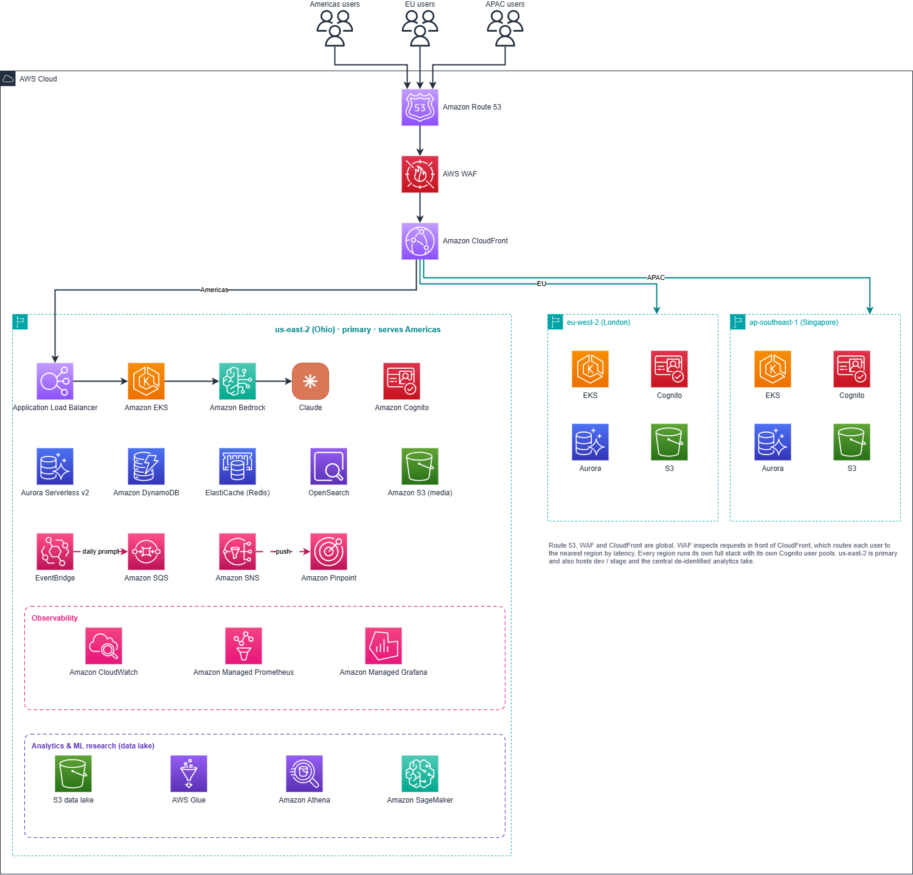
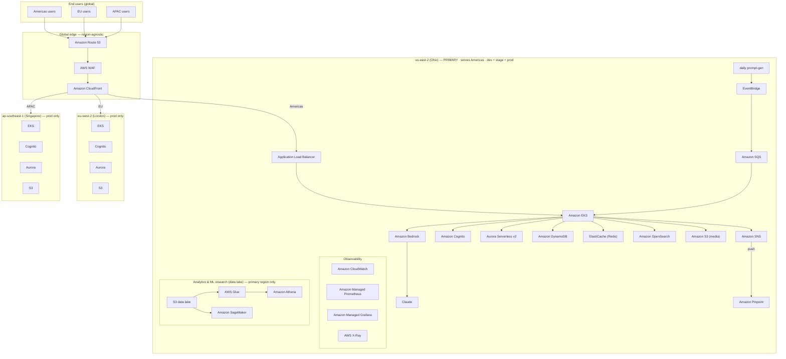

# Scribl D2C — AWS Architecture

Planned production architecture for the Scribl direct-to-consumer app. This is the
target the 1-week POC seeds toward; the POC itself runs a thin slice (API Gateway +
Lambda + DynamoDB, web export on S3/CloudFront) as described in
[`../build-approach.html`](../build-approach.html).

Source assets in this folder:

- **Diagram (PNG):** [`Scribl_AWS_Architecture_D2C.png`](./Scribl_AWS_Architecture_D2C.png) — the canonical visual.
- **Cost model (xlsx):** [`Scribl-D2C-AWS-Estimate-v3.xlsx`](./Scribl-D2C-AWS-Estimate-v3.xlsx) — the 30-month TCO model and source of truth for all cost figures below.

---

## Diagram (Mermaid)

A diffable, AI-readable representation of the same architecture. Built faithfully
from the PNG; if the two ever disagree, the PNG is canonical and this should be
corrected to match.

> **PNG note (from the diagram's own caption):** Route 53, WAF and CloudFront are
> global. WAF inspects requests in front of CloudFront, which routes each user to
> the nearest region by latency. Every region runs its own full stack with its own
> Cognito user pools. us-east-2 / Ohio is primary and also hosts the dev / stage
> environments and the centralized (de-identified) analytics data lake.

---

## Request path & tier roles

1. **Entry — Route 53 → WAF → CloudFront (global).** DNS resolves at Route 53; AWS
   WAF inspects requests in front of the CDN; CloudFront serves static/media at the
   edge and routes dynamic requests to the lowest-latency active region.
2. **Regional ingress — Application Load Balancer.** The ALB (per region, per
   environment) fronts the application tier.
3. **Application tier — Amazon EKS.** One EKS cluster per environment runs the app
   services. Production runs in every active region; **dev and stage stay in Ohio**.
   Cluster count grows 3 → 5 as regions come online.
4. **AI — Amazon Bedrock → Claude.** EKS calls Bedrock for the Claude inference
   features (drawing vision-read/caption, moderation, daily prompt generation).
5. **Auth — Amazon Cognito.** User pools per region; billed on monthly active users.
6. **Data / state tier:**
   - **Aurora Serverless v2** — relational system of record; prod ACUs scale with DAU above a 10-ACU HA floor.
   - **Amazon DynamoDB** — high-velocity on-demand items; stays small.
   - **ElastiCache (Redis)** — always-on cache baseline.
   - **Amazon OpenSearch** — search + log analytics, always-on baseline.
   - **Amazon S3 (media)** — cumulative media store (drawings, voice, text); only ever grows.
7. **Async / engagement lane:** a **daily prompt-gen** job → **EventBridge** →
   **Amazon SQS** feeds work into EKS; **Amazon SNS** → **Amazon Pinpoint** drives the
   push-notification habit loop. Media delivery does not route through NAT.
8. **Observability:** CloudWatch, Amazon Managed Prometheus, Amazon Managed Grafana,
   and AWS X-Ray — a fixed base per environment plus a variable component that grows with API traffic.
9. **Analytics & ML research (data lake):** S3 data lake → AWS Glue → Amazon Athena,
   plus Amazon SageMaker for model training. **Centralized in us-east-2 only** (not
   replicated regionally); gated to switch on after Year 1 (default month 13).
10. **Multi-region:** launches in **us-east-2 (Ohio)**, expands prod to **eu-west-2
    (London)** in Year 2 (~month 13) and **ap-southeast-1 (Singapore)** in Year 2.5
    (~month 25). Each region runs its own EKS + Cognito + Aurora + S3 stack.

---

## Cost / TCO summary

Distilled from [`Scribl-D2C-AWS-Estimate-v3.xlsx`](./Scribl-D2C-AWS-Estimate-v3.xlsx)
— **the workbook is the source of truth.** A 30-month run-rate model (Oct 2026 –
Mar 2029), built bottom-up, at **us-east-2 list prices with no partner discount**.

### Headline

| Metric | Value |
| --- | --- |
| 30-month TCO | **≈ $2,450,084** |
| AI App as % of TCO | **≈ 68.8%** |
| Run rate at launch (M1) | **≈ $9,107 / mo** |
| Run rate at scale (M30) | **≈ $182,633 / mo** |

### Monthly run-rate by pillar ($/mo)

| Pillar | Year 1 avg | Year 2 avg | Yr3 H1 avg | At scale (M30) |
| --- | ---: | ---: | ---: | ---: |
| Compute (EKS) | 5,012 | 8,046 | 10,529 | 11,080 |
| Security (Cognito, WAF) | 561 | 5,924 | 9,210 | 9,971 |
| Networking (ALB, transfer) | 981 | 7,563 | 12,674 | 13,845 |
| Database (DynamoDB, Aurora) | 3,712 | 5,877 | 8,046 | 8,553 |
| Storage (S3) | 50 | 797 | 1,984 | 2,375 |
| AI App (Bedrock + Claude) | 7,118 | 72,944 | 120,739 | 132,340 |
| Data Lake / ML research | 0 | 2,091 | 3,810 | 4,470 |
| **Total run rate** | **17,434** | **103,243** | **166,992** | **182,633** |

### Cost drivers

- **AI inference dominates** — ~60% of the 30-month total, ~two-thirds at full scale.
  Within AI spend at 5M users: **Sonnet 4.6 (vision)** drawing read/caption ≈ **78%**
  (~14.6M calls/mo), **Haiku 4.5** moderation ≈ **22%** (~26.6M calls/mo), **Opus 4.8**
  daily prompt generation **<0.1%** (~150 calls/mo, generated once for all users).
- **User scaling:** 8k → 5M registered users over 30 months. **DAU ≈ 25%** of
  registered, **MAU ≈ 45%**.
- **Regional expansion:** 1 → 3 AWS regions. London ~8% premium, Singapore ~18%
  premium vs Ohio — but only the share of traffic in a region carries its premium,
  so the blended effect on total cost is a few percent.
- Three always-on environments (dev, stage, prod) give compute and database a fixed
  baseline floor (~$11k/mo gross at launch, of which ~$9.5k is demand-driven).

See [`cost-model.md`](./cost-model.md) for the same figures plus unit economics, or
open the workbook directly.
