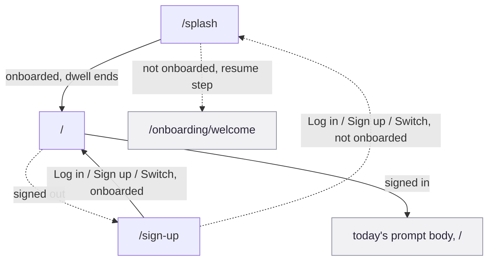

# F1 Launch and authentication

Get a person from a cold start to either onboarding or today's prompt. Three
screens do the whole job: a fork, a bouncer, and an identity gate, wired
together by one small routing helper.

This is the flow every other flow assumes already ran. Nothing else in the
app renders for a person who has not passed through here.

## Provenance

- **Features, routes, guards and data calls** cited to hs2studio/scribl-app at
  `c1b3c2d` on `main`, clean tree.
- **Tiles** from `npm run capture:board` at scribl-app `72c3ab8`, captured
  2026-08-31, committed here under `docs/public/assets/prototype/`. `72c3ab8`
  is not on `main`.
- **Flow name, number and membership** from the
  [screen and flow inventory](/design/screen-flow-inventory).

## The journey

Solid arrows are the forward path with the real trigger. Dashed arrows are the
guard bounces: splash forking to onboarding, the root bouncer, and sign-up's
return trip back through splash for anyone not yet onboarded.

Note what is missing: there is no `splash -> signup` arrow. Splash forks only
to `/` or to onboarding. `/sign-up` is reached exclusively through `/`'s
signed-out bounce.

## Screens in this flow

| Route | What it is for | Screen page |
|-------|----------------|-------------|
| `/splash` | Hold the brand mark, then fork to today's prompt or resumed onboarding | [`/splash`](/prototype/screens/splash) |
| `/` | Bounce a signed-out person to sign-up, or show today's prompt | [`/`](/prototype/screens/root-today) |
| `/sign-up` | Create, log into, or switch an account, then route on onboarding status | [`/sign-up`](/prototype/screens/sign-up) |

## Guards and forks

**Splash never routes to sign-up.** `/splash` reads `hasOnboarded` off
`useOnboardingStore` and forks only two ways: to `/` when onboarded, to the
resumed onboarding step when not (`app/splash.tsx:49-55`). Getting a
signed-out person to `/sign-up` is `/`'s job, not splash's: `app/index.tsx:44-46`
replaces to `/sign-up` once `hydrated` is true and `currentUser` is `null`.

**The root bouncer waits for hydration before deciding anything.** Until
`useAuthStore`'s `hydrated` flips true, `/` shows a bare spinner rather than
either the bounce or the prompt body (`app/index.tsx:63-71`), so a slow
hydrate cannot flash the wrong screen.

**`/sign-up` is the fork that decides splash versus root.** Every successful
path on the sign-up screen, sign up, log in, or switch, calls
`routePostAuth()` (`app/sign-up.tsx:95-100`), which runs `checkOnboarded()`
and hands the result to `postAuthRoute()`
(`src/lib/postAuthRoute.ts:20-22`): `/` if truly onboarded, `/splash`
otherwise.

**`postAuthRoute` treats an unresolved check as "not onboarded," on purpose.**
`hasOnboarded === null` is folded into the `false` branch by design
(`src/lib/postAuthRoute.ts:16-18`), so an already-onboarded person whose
onboarding check has not resolved yet gets routed back through `/splash`
rather than straight to `/`. Splash will resolve the check itself and forward
them on, so the person loses a beat, not their progress. Worth naming because
it reads, out of context, like a bug: a returning user briefly re-shown the
launch screen. It is not; it is the safe default the source comment at
`src/lib/postAuthRoute.ts:9-14` calls a deliberately pure branch.

**The splash dwell has a dev-only escape hatch.** `app/splash.tsx:46-48` skips
both forks entirely when `__DEV__` and a capture flag are set, so the
screenshot harness can hold on the brand screen. It is gated out of any
shipped build, but a reader diffing this flow against a screenshot should
know the branch exists.

**Unreadable local storage resolves to "not onboarded" rather than stalling.**
If `checkOnboarded()` throws, the catch in the store still resolves
`hasOnboarded: false` instead of leaving the promise rejected
(`src/stores/useOnboardingStore.ts:177-184`). Splash always reaches one of its
two forks; there is no third branch here for "something went wrong." The cost
of that choice is a false-negative onboarding read sending an onboarded person
back through onboarding's resume logic, which is a safe direction to fail in,
but it is a silent one.

## What the capture shows

<figure><figcaption><strong>1 /splash</strong>The brand mark, nothing tappable.</figcaption></figure>
<figure><figcaption><strong>2 /</strong>Today's prompt, already submitted for this captured session.</figcaption></figure>
<figure><figcaption><strong>3 /sign-up</strong>Captured in log-in mode, with the demo new-user toggle visible.</figcaption></figure>

Two things the tiles show that the prose does not:

- **The captured `/` is the already-submitted state, not the empty one.** The
  button reads "Draw another," not "Open the canvas." A reader judging this
  flow from the tile alone would not see the unsubmitted first-visit state at
  all; it is documented on the [`/` screen page](/prototype/screens/root-today)
  from source, not from this tile.
- **The sign-up tile carries a demo-only control.** The `NewUserToggle` next
  to the log-in button (`components/demo/NewUserToggle.tsx`) is a device-wide
  debug switch, not something a real account holder would see in a shipped
  build.

## Notes for planning

Authored here, not read out of the app.

### The three screens only make sense read together

Each screen page says this on its own, and it is worth restating at the flow
level: `/splash`'s "onboarded" fork depends on state that `/sign-up` sets
before routing, and its "not onboarded" fork depends on the draft store that
only the onboarding canvas writes. No single screen page in this flow, read
alone, explains why the fork is correct. That is a property of this being a
three-screen state machine with the state split across two stores, not a flaw
in any one page.

### One helper carries the whole seam between F1 and F2

`postAuthRoute()` (`src/lib/postAuthRoute.ts:9-22`) is the entire decision of
whether a person sees onboarding again. It is deliberately small and pure,
which is good, but it means every future change to "who counts as onboarded"
has to route through this one function or the guarantee silently breaks. It
is worth flagging as the single point of failure it is, rather than one
helper among many.

### The root route's dual identity has no visible seam

`/` is both F1's landing point and F4's step one, and the [`/` screen
page](/prototype/screens/root-today) already calls this out: the bounce logic
and the prompt body live on the same screen with no visual distinction
between "I just signed in" and "I opened today's prompt." Repeating it here
because it is the reason F1 does not get a clean exit screen of its own; it
hands off mid-render rather than at a boundary.
