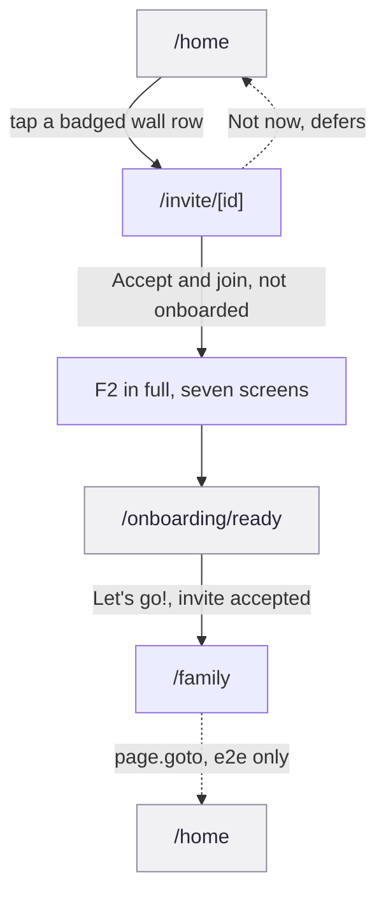

# F3 Invite and join

Get an invited person from a wall invitation into that wall as a full member.
On paper, one screen. In practice, most of this flow is F2's seven-screen
onboarding run in full, entered from a different door.

This flow matters because it is where the app's own claim about itself is
weakest: it calls itself "invite and join," but nothing in the app can invite
anyone who is not already inside it.

## Provenance

- **Features, routes, guards and data calls** cited to hs2studio/scribl-app at
  `c1b3c2d` on `main`, clean tree.
- **Tiles** from `npm run capture:board` at scribl-app `72c3ab8`, captured
  2026-08-31, committed here under `docs/public/assets/prototype/`. `72c3ab8`
  is not on `main`: it is the same unmerged flow-map branch that seeds a
  draft and an invite record before capture, which is the only reason the
  invite tile below shows the accept card instead of the guard state.
- **Flow name, number and membership** from the
  [screen and flow inventory](/design/screen-flow-inventory).

## The journey

Solid arrows are the forward journey, labelled with the real control. Dashed
arrows are a bounce or a hop that is not a UI click. Grey nodes sit outside
this flow's own screen surface.

## Screens in this flow

| Route | What it is for | Screen page |
|-------|-----------------|-------------|
| `/invite/[id]` | Accept or defer a wall invitation. This flow's only screen | [`/invite/[id]`](/prototype/screens/invite-id) |
| `/onboarding/welcome` through `/onboarding/ready` | F2 in full. See [F2 First-run onboarding](/prototype/workflows/f2-first-run-onboarding) rather than duplicated here | -- |
| `/family` | Land in the wall that invited you | [`/family`](/prototype/screens/family) |
| `/home` | Where the flow starts, and where "Not now" returns to | [`/home`](/prototype/screens/home) |

## Guards and forks

**The flow's entry point does not exist yet.** The single biggest planning
fact about F3 is not a guard inside the flow, it is what feeds the flow.
`/invite/[id]` is reachable from exactly one place in the entire app: a tap
on a badged wall row already inside the signed-in home screen
(`app/home.tsx:205`). There is no deep link, no email send, no token, and no
hosted landing page; the router file's own header calls itself an in-app
stand-in for a page that is unfunded and out of scope
(`app/invite/[id].tsx:1-18`). "An invited person arrives from outside the
app" is the inventory's framing of the intended feature, not a description
of what ships today. Accepting an invite currently requires the invitee to
already have an account, already be signed in, and already see the wall in
their own list.

**F2 in full is the seam, not a shortcut.** Accept resolves the person's
onboarding status and branches: not yet onboarded replaces to
`/onboarding/welcome` (`app/invite/[id].tsx:96`); already onboarded replaces
straight to `/family` with the wall id (`app/invite/[id].tsx:104`). For the
common case of a brand-new invitee, that means walking all seven F2 screens,
including the draft guard and the type-or-record fork, before ever landing
in a wall. `/onboarding/ready` is the exit: with an accepted invite waiting,
it replaces to `/family` with the wall id (`app/onboarding/ready.tsx:73`);
without one it goes to `/`. See the F2 workflow page's own guards section for
the draft-guard mechanics inside that stretch.

**"Not now" defers, it does not decline.** The screen offers "Not now" as its
only negative action, and it does not call the store's `decline` method. It
only replaces to `/home`, leaving the invite record pending so it reappears
there (`app/invite/[id].tsx:107-113`, comment at `:107-110`).
`useInvitesStore.decline` (`src/stores/useInvitesStore.ts:144-175`) is real
code, with its own `leaveWall` call, but a repo-wide search finds no call
site for it outside the store's own definition. Either a decline affordance
was designed and cut from this screen, or it is dead code waiting for a
button. Either way, nothing in the app today lets a person actually say no
to an invitation.

**The final hop from /family to /home is asserted, not demonstrated.**
`e2e/invite-flow.spec.ts` walks this flow across two accounts up to landing
in `/family`, then calls `page.goto("/home")` directly at line 195 rather
than tapping any in-app control. The assertion that follows, that the wall
now shows up unbadged, is real coverage of the state change. What is not
covered by any test, or shown on this diagram as a real click, is a person
tapping their own way from the wall back to the home list.

**A copy bug rides along on every invite.** `inviteHeadline` appends the
literal word "wall" after the wall's own name
(`src/lib/simulatedInvites.ts:195-198`). A wall already named with "wall" in
it, such as "Family Wall," renders as "Family Wall wall." Visible on the
tile below.

## What the capture shows

<figure><figcaption><strong>1 /invite/[id]</strong>The accept card, only visible because 72c3ab8 seeded an invite record.</figcaption></figure>
<figure><figcaption><strong>2 /family</strong>The wall the invite pointed at, after F2 in full.</figcaption></figure>
<figure><figcaption><strong>3 /home</strong>Where the flow starts, and where a deferred invite sends you back.</figcaption></figure>

Journey order here is the invite tile, then the two landing screens, not the
seven F2 tiles in between; those live on the F2 workflow page. Two things
these tiles confirm on their own:

- **The invite tile only exists because of the capture seed.** On `main` with
  no seeded invite record, this route photographs as the "This invite is no
  longer available" empty state (`app/invite/[id].tsx:65-76`), not the card
  shown here. The working accept card is a property of `72c3ab8`, not of
  `main`.
- **The doubled "wall wall" is visible on the tile itself**, not just in the
  source. It reads as a real product-facing defect, not a hypothetical one.

## Notes for planning

Authored here, not read out of the app.

### "Arrives from outside the app" is the roadmap, not the feature

Everything else on this page assumes the wording in the inventory and in the
router file's own header, that this is meant to work for someone outside the
app entirely. Tracing the actual call sites shows that promise is entirely
unbuilt: there is no transport for an invite to leave the device that sent
it. `src/lib/simulatedInvites.ts:12-16` says outright that invite-on-one-
device, accept-on-another does not work, because the request does not exist
anywhere but local storage. Anyone estimating "make invites work for real"
should read this as replacing the whole mechanism, not wiring up a button,
because the button already sequences correctly (accept, then resolve
onboarding, then route); only the transport under it is fake.

### F3 does not need its own guard logic because it borrows F2's

Every draft guard, every resume-by-step behavior, every piece of state
machinery that makes the middle of this flow work belongs to F2, not F3.
That is the right shape for this page: duplicating F2's guards and forks
here would drift the moment F2's own page changes. The only genuinely F3-
specific facts are the entry gap, the missing decline, and the copy bug
above.

### Decline is a designed feature nobody wired up

`useInvitesStore.decline` does real work, including giving back membership
through `leaveWall`, and no screen calls it. Worth deciding on purpose
whether declining an invite outright is a feature this POC intends to ship,
because right now the store is built for it and the UI is not. That mismatch
is easy to miss until someone in a demo asks how to say no to an invite.
