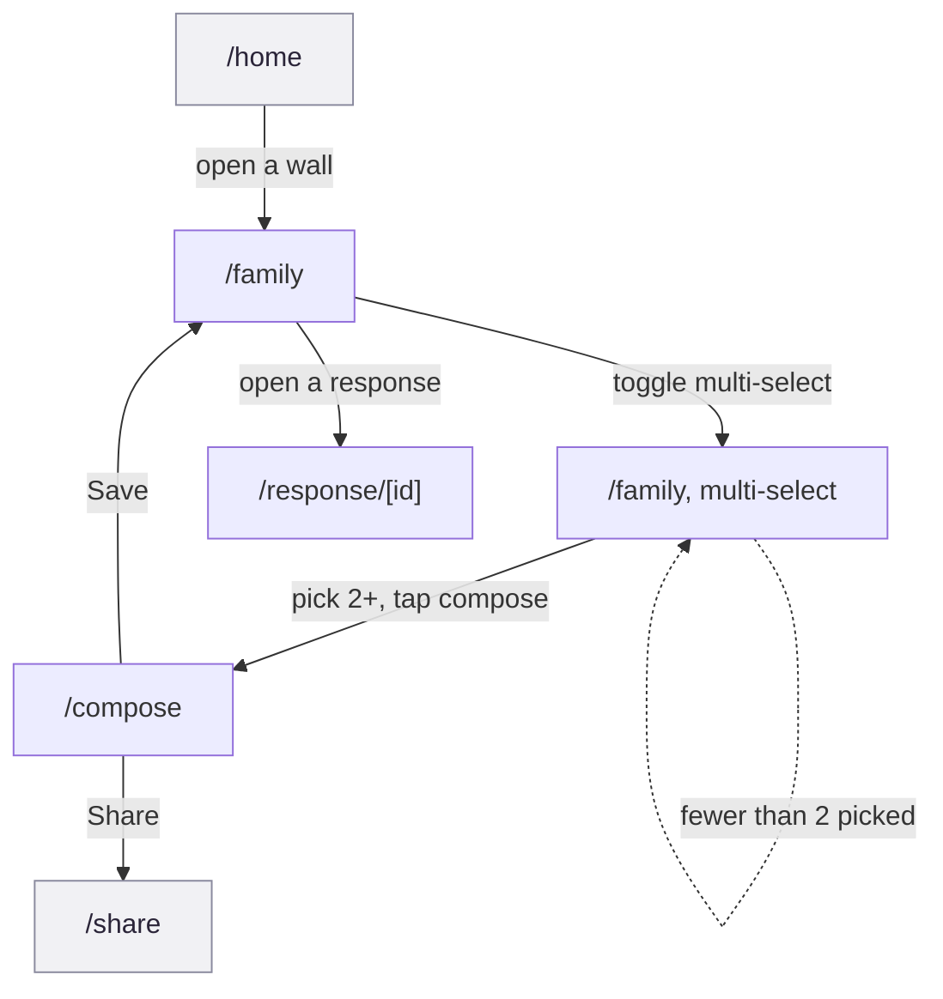

# F5 Wall browsing and composition

Look at what people posted, react to it, and combine drawings into one piece.
Three screens carry the browsing, and a fourth, reachable only from a hidden
toggle, carries the composing.

This is the flow that gives the daily drawing habit a reason to check back in:
it is where a person sees what everyone else made and does something with it
beyond posting their own.

## Provenance

- **Features, routes, guards and data calls** cited to hs2studio/scribl-app at
  `c1b3c2d` on `main`, clean tree.
- **Tiles** from `npm run capture:board` at scribl-app `72c3ab8`, captured
  2026-08-31, committed here under `docs/public/assets/prototype/`. `72c3ab8`
  is not on `main`: it is an unmerged flow-map branch that seeds a wall and a
  compose selection before visiting those routes cold. That is why the
  multi-select and compose tiles below show live state rather than a guard.
- **Flow name, number and membership** from the
  [screen and flow inventory](/design/screen-flow-inventory).

## The journey

Solid arrows are the forward journey, labelled with the real control. The
dashed arrow is the compose guard holding multi-select in place until enough
drawings are picked. Grey nodes sit outside F5: `/home` is F5's own entry
point but belongs to F3/F7/F8 too, and `/share` is F6's only screen.

## Screens in this flow

| Route | What it is for | Screen page |
|-------|-----------------|-------------|
| `/family` | The wall grid: everyone's drawing for a prompt, day by day, and where multi-select starts | [`/family`](/prototype/screens/family) |
| `/family`, multi-select state | The same grid with cards selectable and a compose button, the only door to `/compose` | [`/family`](/prototype/screens/family) |
| `/compose` | Arrange two or more picked drawings into one composed piece | [`/compose`](/prototype/screens/compose) |
| `/response/[id]` | The detail view for one drawing: full art, caption, reaction | [`/response/[id]`](/prototype/screens/response-id) |

`/response/[id]` is also F6's entry point; F6 covers only its role there. Full
treatment of `/family`'s two-in-one interface (group wall versus personal
archive) lives on the screen page, not here.

## Guards and forks

**`/home` is the hub, but this flow only cares about one exit.** `/home` sits
in four flows (F3, F5, F7, F8; `product/prototype/screens/home.md`). For F5
specifically, its only relevant job is the "open a joined wall" row, which
navigates to `/family` with `channelId` and `promptId` params
(`app/home.tsx:208`). Everything else `/home` offers (invite, create-wall,
settings) belongs to the other three flows and never touches this journey.

**`/family` is a landing point for four flows, but F5 owns its browsing
behaviour outright.** F3 and F4 land there too, and F7 reaches out from it,
but the grid, the hearting, the detail navigation, and multi-select are F5's
alone; the other three flows pass through without touching them
(`product/design/screen-flow-inventory.md`).

**The multi-select toggle is the only door to `/compose`, and it is easy to
miss.** It is a small, unlabeled icon in `/family`'s header
(`app/family.tsx:898-916`). There is no tab, no onboarding hint, and no other
entry point anywhere in the app. A person who never taps that icon never
finds composition. Once toggled, each card becomes selectable
(`toggleComposeSource`/`handleToggleSelect`, `app/family.tsx:768-803`), and
selections write into `useComposeStore` (`app/family.tsx:785`) rather than
into route params, which is how `/compose` picks them up.

**The compose button itself is gated on a count, not a toggle.** `/family`'s
compose button stays disabled while `composeSources.length < 2`
(`app/family.tsx:918-933`). `/compose` re-enforces the same floor on its own
side: `MIN_SOURCES` is `2` (`app/compose.tsx:12`), and with fewer than two
sources the screen renders a guard message and a way back instead of the
canvas (`app/compose.tsx:37-55`). So the guard exists twice, once to keep the
button dead and once to keep the route itself honest if reached with too few
sources some other way.

**Composing has two exits, and only one is undo-able going forward.** Save
replaces to `/family` with the origin channel id and clears the compose
selection (`components/compose/ComposeStage.tsx:284-308`,
`src/stores/useComposeStore.ts:53`). Share calls the same underlying
`saveComposition()` and then replaces to `/share`
(`components/compose/ComposeStage.tsx:310-347`), which means tapping Share
also permanently saves to the personal wall; there is no share-without-save
path. That seam belongs to F5, since it happens before F6's flow starts.

**Reacting happens inline, without leaving the grid.** Hearting a response is
a tile control inside `WallMemberCard` on `/family` itself
(`app/family.tsx:752-760`); opening `/response/[id]` is a separate, optional
step for the fuller view, not a requirement to react.

## What the capture shows

Journey order: the wall, the multi-select state that unlocks compose, the
composer itself, and the response detail leaf.

<figure><figcaption><strong>1 /home</strong>F5's entry point; a wall row is the only relevant exit here.</figcaption></figure>
<figure><figcaption><strong>2 /family</strong>The real wall grid, three drawn responses, not the empty state.</figcaption></figure>
<figure><figcaption><strong>3 /family, multi-select</strong>All three cards selected, compose button live.</figcaption></figure>
<figure><figcaption><strong>4 /compose</strong>The real composer, past the two-source guard.</figcaption></figure>
<figure><figcaption><strong>5 /response/[id]</strong>The detail leaf, reached from a wall card.</figcaption></figure>

What the tiles show that the prose above does not:

- **Tile 18 is not the empty state the inventory recorded.** The inventory's
  Finding 2 says `/family` reads "Pick a family wall from Home" with no wall
  in context. That was true of the `main`-branch capture it read. It is not
  true here: `72c3ab8` seeds a wall, so tile 18 shows the real grid, three
  drawn responses and a Today section. The empty-state string still exists in
  the source (`app/family.tsx:962-968`, gated on `!channelId`); it is just not
  what this tile shows.
- **Tile 20 is the real composer, not a guard message.** The inventory's
  screen table lists `/compose` as "yes, guard message." This tile shows a
  populated canvas with one drawing placed and three in the tray, because the
  capture branch seeds sources before visiting the route and clears the
  two-source guard.
- **Tile 21's artwork panel is not black.** The inventory's Finding 3 says the
  artwork panel renders solid black. This tile shows a visible orange
  sun-and-rays glyph on a white card. It is the wrong drawing, an orange sun
  glyph seeded in place of the real one, the same seed-data placeholder that
  also shows on `/onboarding/story` and `/share`, one defect surfacing on
  three screens rather than three separate bugs. It is not a black rectangle
  and not a rendering failure.

## Notes for planning

Authored here, not read out of the app.

### The compose entry is a deliberate constraint that also caps who ever finds it

`/compose` has no persistent nav entry anywhere in the app
(`product/design/screen-flow-inventory.md`, F5 section; confirmed on
`app/compose.tsx`'s own screen page). It is reachable only by opening
`/family`, tapping an unlabeled multi-select icon in the header
(`app/family.tsx:898-916`), and picking at least two drawings. That three-step,
undiscoverable chain is consistent with composing being a tool applied to a
specific set of drawings rather than a place worth bookmarking, but it also
means the feature's real audience is whoever happens to find the icon. Worth
deciding on purpose whether that discoverability trade is acceptable before
treating composition as a finished feature rather than a hidden one.

### Two stale inventory findings, corrected by the same newer capture

Finding 2's empty `/family` and the `/compose` guard-message row are both
artifacts of the `main`-branch capture the inventory read; `72c3ab8` seeds
state that clears both. That is the same drift the F2 workflow page's note 1
already caught for the onboarding tiles: a finding tied to one capture
generation goes stale the moment a newer one lands, silently, with nothing in
the inventory to say so. Two independent instances of the same failure mode in
one pass is worth fixing at the process level, not patching screen by screen.

### Save and Share are not equally weighted, and the UI does not say so

Both compose exits write the composition to the personal wall; Share is not a
lighter, non-committing action even though it visually reads as one next to
Save (`components/compose/ComposeStage.tsx:284-347`). A person who only meant
to share once still ends up with a saved copy on their wall. That is a real
product decision buried in shared code, not stated anywhere in the interface.
