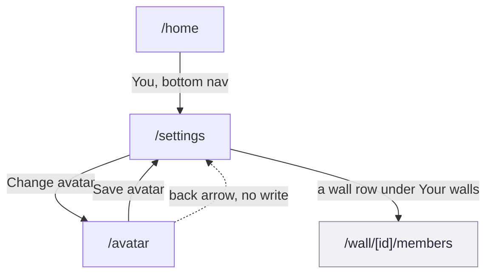

# F8 Account and profile

Change your name, your email, your avatar, your theme. The account hub, one
screen deep off Home, with a side trip to draw a new avatar and a second job
it did not ask for: the only door into wall administration.

## Provenance

- **Features, routes, guards and data calls** cited to hs2studio/scribl-app at
  `c1b3c2d` on `main`, clean tree.
- **Tiles** from `npm run capture:board` at scribl-app `72c3ab8`, captured
  2026-08-31, committed here under `docs/public/assets/prototype/`. `72c3ab8`
  is not on `main`; it is an unmerged flow-map branch. Neither `/settings` nor
  `/avatar` is draft-guarded, so this caveat mostly affects why the avatar
  tile shows a drawing rather than an empty canvas: the branch seeds one.
- **Flow name, number and membership** from the
  [screen and flow inventory](/design/screen-flow-inventory).

## The journey

Solid arrows are the forward journey, labelled with the real control. The
dashed arrow is the avatar screen's back-arrow exit, a bounce with no write
rather than a completed save. `/wall/[id]/members` is drawn grey because it
belongs to F7 Wall creation and administration; F8 only supplies its one
entry point.

## Screens in this flow

| Route | What it is for | Screen page |
|-------|-----------------|-------------|
| `/home` | Entry point only: the "You" icon in the bottom nav | [`/home`](/prototype/screens/home) |
| `/settings` | The hub: name, email, password field, avatar link, dark mode, wall list, log out | [`/settings`](/prototype/screens/settings) |
| `/avatar` | Draw your own avatar on the shared canvas, cropped to a circle | [`/avatar`](/prototype/screens/avatar) |

`/home` is listed for its entry point only; the rest of its surface belongs
to F3, F5 and F7. `/wall/[id]/members` is F7's screen, not F8's, even though
F8 is its only door; see Guards and forks.

## Guards and forks

**Settings leaks into F7.** `/settings` renders a "Your walls" list whose
rows navigate to `/wall/[id]/members`
(`app/settings.tsx:157-174`, push at `:163-165`). That screen belongs to
[F7 Wall creation and administration](/prototype/workflows/f7-wall-creation-and-administration),
not F8, and it is F7's only entry point in the whole app after the add-member
affordance was deliberately removed from `/family`
(`app/family.tsx:1107-1111`). So the account-and-profile hub also functions
as the wall-administration hub, one hop earlier than the feature it opens.

**Two settings that look identical and are not.** Display name and email
round-trip through a real `PATCH /users/{id}`
(`app/settings.tsx:43-52`, `92-99`, `106-115`) and persist for every device
the account signs into. Dark mode never leaves the device: `setMode` writes
straight to AsyncStorage under a per-user key with no API call in its path at
all (`src/stores/useThemeStore.ts:113-124`,
`components/settings/DarkModeToggle.tsx:22-30`). Both sit in identically
styled rows on the same screen with nothing to tell a person which one is
durable account state and which is a local preference.

**The password field is a visible dead end.** It takes keystrokes into local
state (`app/settings.tsx:32, 122-129`), and `handleSave` never reads it,
sending only `displayName` and `email` (`app/settings.tsx:43-52`). The screen's
own caption says "Not wired up in this POC" (`:131-133`), which is honest, but
nothing disables the field or blocks keyboard focus. The caption is the only
guard there is.

**Avatar exits two different ways, and only one of them writes.** Pressing
Save crops the drawing to 256x256, PATCHes it to the server as
`avatarImage`, and only routes back to `/settings` once that PATCH returns ok
(`app/avatar.tsx:31-42`, `58-62`). The header back arrow instead exits
immediately with no write and no confirm dialog
(`app/avatar.tsx:46`); an unsaved drawing is silently lost.

**DrawPad lands here too, and it behaves differently than it does elsewhere.**
`/avatar` reuses the same shared canvas as `/draw` (F4) and
[`/onboarding/canvas`](/prototype/workflows/f2-first-run-onboarding) (F2)
(`components/canvas/DrawPad.tsx:206-212`), but with a circular mask
(`frameShape="circle"`, `app/avatar.tsx:54`) instead of the rectangular frame
the other two use, and with the full base palette rather than onboarding's
narrowed one (`app/avatar.tsx:48-56`, `components/canvas/DrawPad.tsx:200-204`).
One canvas component, three screens, three flows, two different visual
contracts.

## What the capture shows

Journey order: Home's entry point, then Settings, then Avatar.

<figure><figcaption><strong>1 /home</strong>The "You" icon at the right of the bottom nav is F8's only door.</figcaption></figure>
<figure><figcaption><strong>2 /settings</strong>The hub, and also the only door into wall administration.</figcaption></figure>
<figure><figcaption><strong>3 /avatar</strong>Circular mask, full palette, no clear/trash button visible.</figcaption></figure>

Two things the tiles show that the prose does not:

- **Settings' bottom nav icon is unlabelled.** The tile shows a plain person
  icon with no text caption next to the home and draw icons either side of
  it; nothing in the capture identifies it as "Settings" or "Account" before
  it is tapped.
- **The avatar tile has no clear or trash control**, only undo and Save.
  That is a toolset-flag effect, not something `/avatar` itself decides; see
  [note on the avatar screen page](/prototype/screens/avatar).

## Notes for planning

Authored here, not read out of the app.

### Dark mode's non-persistence is a decision hiding behind a toggle

The toggle looks exactly as durable as the name and email fields above it,
but a `setMode` call never leaves the device
(`src/stores/useThemeStore.ts:113-124`). For a POC that is a reasonable
shortcut. Before this ships past a POC, someone should either make theme a
real account field or change the UI so it stops implying parity with the two
fields that do round-trip.

### The avatar crop is platform-inconsistent, and the gap is data volume, not correctness

`squareAvatarDataUri`, the helper that crops the drawing to 256x256 before the
PATCH, only crops on web (`src/lib/image.ts:15-22`). On native it is a no-op,
so a native Save sends the full, uncropped PNG in the request body instead of
the bounded crop web gets. Every future profile fetch for that user now
carries whatever size that uncropped export turns out to be. Worth measuring
the actual payload before this leaves POC status, not assuming the visual
result (a circle either way, since the mask is drawn in the canvas UI, not
in the export) means the two platforms cost the same.

### F8 owns the account hub and, without saying so, F7's front door

The most consequential fact on this page is not about F8's own three
screens; it is that `app/settings.tsx:164` is the entry point for
[F7 Wall creation and administration's members screen](/prototype/workflows/f7-wall-creation-and-administration).
Any redesign of the account settings screen that moves or removes the "Your
walls" section without checking F7 first will delete wall administration's
only door in the app, not just tidy up a settings page.
